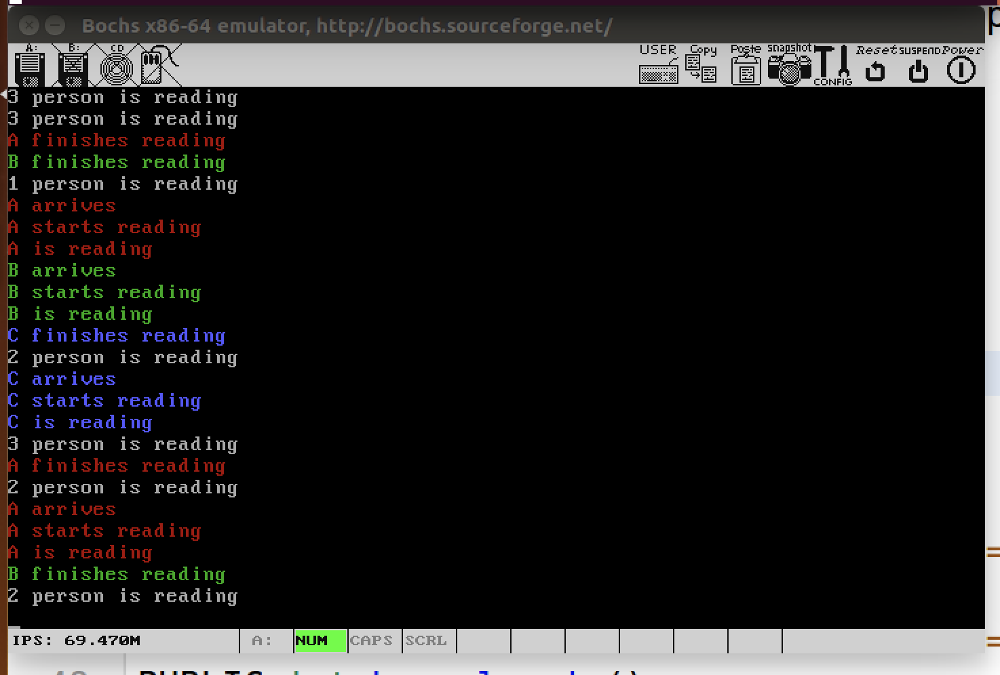
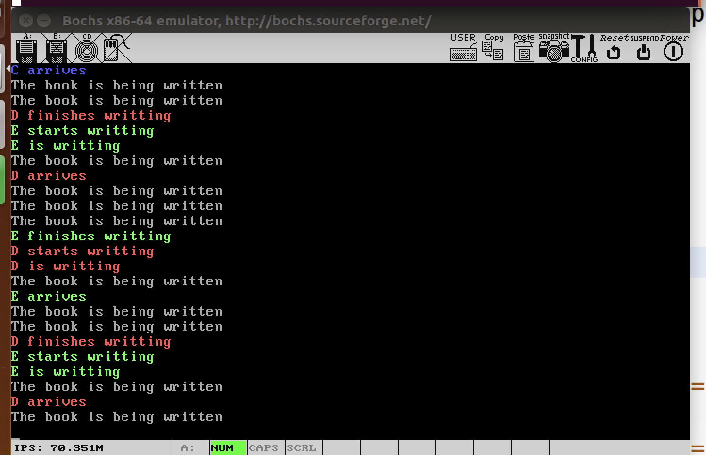
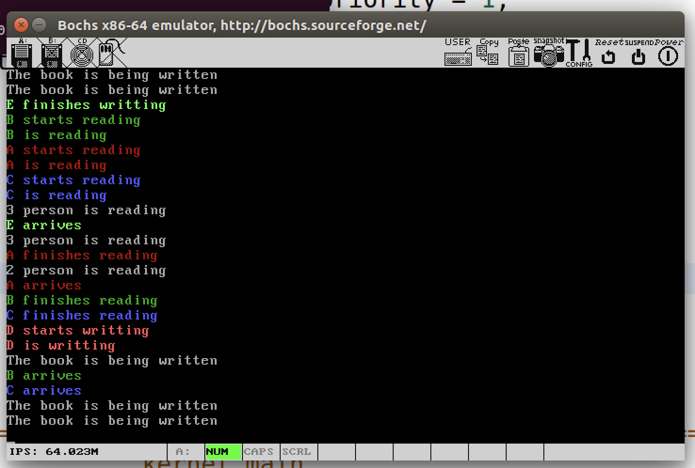

# 操作系统第四次实验

## 运行程序

在main.c文件的init_tasks()函数中初始化strategy变量

例如：

```c
strategy = 2;
```

该变量决定具体的调度策略（读写公平0、读优先1、写优先2）。

在const.h文件中修改MAX_READERS的值可以限制最大读者人数，也可以重定义TIME_SLICE来改变时间片长度。

在code目录下输入make run即可运行

## 读写策略

在以下策略中，使用了如下信号量，
|信号量|作用|初值|
|:---:|:---:|:---:|
|rw_mutex|实现读写互斥、写写互斥|1|
|r_mutex|读进程互斥访问readers（读者人数）|1|
|w_mutex|写进程互斥访问writters(写者人数)|1|
|queue|制衡读写者|1|
|n_r_mutex|限制读者人数|MAX_READERS|

### 读者优先

对应**strategy = 1**

读：

```c
void read_v1(char proc, int slices, char color){
	printf("%c%c arrives\n", color, proc);	
	P(&n_r_mutex);	    
    P(&r_mutex); // 每个读者原子地访问readers变量
	if (readers==0)
		P(&rw_mutex); // 有读者，禁止写
	readers++;
	V(&r_mutex);
	// 读过程
	read_proc(proc, slices, color);
    P(&r_mutex);
	readers--;
	if (readers==0)
		V(&rw_mutex); // 没有读者，可以开始写了
	V(&r_mutex);
    V(&n_r_mutex);
}
```

写：

```c
void write_v1(char proc, int slices, char color){
	printf("%c%c arrives\n", color, proc);
	P(&rw_mutex);
	writting = 1;
	// 写过程
	write_proc(proc, slices, color);
	writting = 0;
	V(&rw_mutex);
}
```

第一个读进程抢占r_w_mutex之后，后续读进程可以进入，但是写者会被阻塞，直到所有读进程都完成，从而实现读者优先。



### 写者优先

对应**strategy = 2**

读：
```c
void read_v2(char proc, int slices, char color){
	printf("%c%c arrives\n", color, proc);
	P(&queue);
	P(&n_r_mutex);
	P(&r_mutex); // 每个读者原子地访问readers变量
	if (readers==0)
		P(&rw_mutex); // 有读者，禁止写
	readers++;
	V(&r_mutex);
	V(&queue);
	read_proc(proc, slices, color);

	P(&r_mutex);
	readers--;
	if (readers==0)
		V(&rw_mutex); // 没有读者，可以开始写了
	V(&r_mutex);

	V(&n_r_mutex);
}
```

写：
```c
void write_v2(char proc, int slices, char color){
	printf("%c%c arrives\n", color, proc);	
	P(&w_mutex); // 写者互斥地访问
	// 写过程
	if (writters==0)
		P(&queue); // 第一个写者抢到资源就不放手，从而实现写者优先
	writters++; 
	V(&w_mutex);

	P(&rw_mutex); // 写者互斥地写
	writting = 1;
	write_proc(proc, slices, color);
	writting = 0;
	V(&rw_mutex);

	P(&w_mutex);
	writters--;
	if (writters==0)
		V(&queue);
	V(&w_mutex);
}
```

读进程每次访问readers变量前，要先申请queue资源，并在真正开始读之前释放queue，写进程以其人之道还治其人之身，第一个写进程为后续写进程霸占queue资源，直到所有写进程都结束后才释放，从而实现写者优先。



### 读写公平

对应**strategy = 0**

这是用来防止进程饿死的，在前面两种实现中，读者优先可能会导致写进程被饿死，写者优先可能会导致读进程被饿死，因此为了防止进程被饿死，需要一种更公平的调度策略。

读进程的代码和上面一个方法的代码完全一致，不再重复贴出。

写：
```c
void write_v0(char proc, int slices, char color){
	printf("%c%c arrives\n", color, proc);
	P(&queue);
	P(&rw_mutex);
	writting = 1;
	V(&queue);
	// 写过程
	write_proc(proc, slices, color);
	writting = 0;
	V(&rw_mutex);
}
```
读进程不能不受限制的霸占rw_mutex，第一个写进程也不再帮后续写进程霸占queue，改为每个写进程自行竞争，这样一来，读写者能相互制衡，实现读写公平，防止了进程饿死。



## 系统调用代码实现

```c
PUBLIC void p_process(SEMAPHORE* s){
	disable_int();
    s->value--;
    if (s->value < 0){
        p_proc_ready->blocked = 1;
        s->p_list[s->tail] = p_proc_ready;
        s->tail = (s->tail + 1) % NR_PROCS;
        schedule();
    }
	enable_int();
}

PUBLIC void v_process(SEMAPHORE* s){
	disable_int();
    s->value++;
    if (s->value <= 0){
        s->p_list[s->head]->blocked = 0; // 唤醒最先进入队列的进程
        s->head = (s->head + 1) % NR_PROCS;
    }
	enable_int();
}

PUBLIC void sys_sleep(int milli_sec) 
{
	int ticks = milli_sec / 1000 * HZ * 10;  // 乘10是为了修正系统的时钟中断错误
	p_proc_ready->sleeping = ticks;
    schedule();
}

PUBLIC void sys_write_str(char* buf, int len)
{
    CONSOLE* p_con = console_table;
	for (int i = 0;i < len; i++){
		out_char(p_con, buf[i]);
	}
}

PUBLIC	system_call	sys_call_table[NR_SYS_CALL] = {sys_get_ticks, sys_write_str, sys_sleep, p_process, v_process};
```

```nasm
get_ticks:
	mov	eax, _NR_get_ticks
	jmp	sys_call_block

write_str:
	mov	eax, _NR_write_str
	mov	ebx, [esp+4]	;参数1
	mov	ecx, [esp+8]	;参数2
	jmp	sys_call_block

sleep_ms:
	mov	eax, _NR_sleep_ms
	mov	ebx, [esp+4]
	jmp	sys_call_block

P:
	mov	eax, _NR_P
	mov	ebx, [esp+4]
	jmp	sys_call_block

V:
	mov	eax, _NR_V
	mov	ebx, [esp+4]
	jmp	sys_call_block

sys_call_block:
	int	INT_VECTOR_SYS_CALL
	ret
	
sys_call:
    call    save
	;push	dword [p_proc_ready] ;以防发生进程切换，这里在开中断前压入
    
		sti
	
		push	ecx
		push	ebx
    call    [sys_call_table + eax * 4]
		pop		ebx
		pop		ecx

    mov     [esi + EAXREG - P_STACKBASE], eax        
	
		cli
    ret
```

