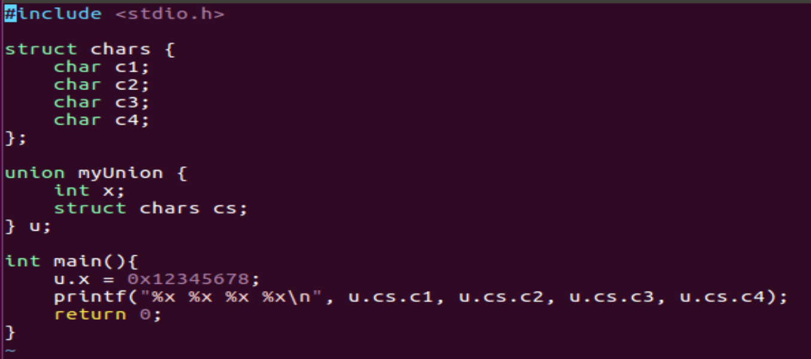
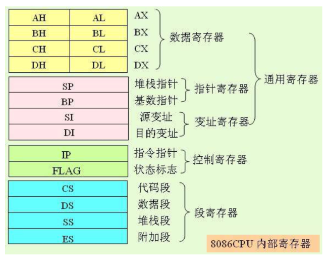

# Lab1: Check List

**Q: 什么是复杂指令集? 什么是精简指令集? 80x86 采用的是哪种?**

A: 精简指令集和复杂指令集是 CPU 的两种设计模式。精简指令集采用的设计思想是使硬件尽量简单，因此精简指令集使用一条指令完成一个简单操作，比如 loading, evaluating, storing. 而复杂指令集想要一条指令干更多的事，完成多个简单操作，比如一条乘法指令同时完成从内存中读取数据到寄存器和在寄存器中完成运算，然后保存回内存这几件事。
80x86 采用的是复杂指令集, 比如 cmp byte[addr], 0 这条指令同时完成了从内存读数据和运算以及设置 flag 这几件事。

**Q: 什么是小端存储? 什么是大端存储? 80x86 采用的是哪种?**

A: 小端存储和大端存储是在内存中存储多字节数据类型的两种方式。如果使用小端存储，那么对于一个多字节的数据，最低地址存储的是 LSB (Least Significant Byte), 最高地址存储的是 (Most Significant Byte); 而大端存储相反，最低地址存的是 MSB, 最高地址存的是 LSB。举例来说，对于一个 Int x = 0x12345678, 如果是小端存储，那么在内存中存储的顺序从低地址到高地址就是 0x78, 0x56, 0x34, 0x12; 如果是大端存储, 那么在内存中存储的顺序从低地址到高地址就是 0x12, 0x34, 0x56, 0x78。
80x86 采用的是小端存储。下面是一段简单的验证程序，在 80x86 的机器上输出是 78 56 34 12, 验证了 80x86 是小端存储。


**Q: 8086 有哪 5 类寄存器? 请分别举例并说明作用。**

A：8086 有数据寄存器，指针寄存器，变址寄存器，控制寄存器，段寄存器。其中 ax, bx, cx, dx 是数据寄存器，si 和 di 是变址寄存器，sp 和 bp 是指针寄存器，flag 和 ip 是控制寄存器，cs, ds, ss, es 是段寄存器。

数据寄存器的作用是用来存放参与运算的数据，比如 ax, bx, cx, dx; 指针寄存器存储指向某些位置的指针，比如 sp 是栈指针寄存器，存储当前栈顶元素的地址，bp 是基指针，存储当前栈帧的基地址；si 是源变址寄存器，可以用来存相对于 ds 段的源变址指针，di 是目的变址寄存器，可以用来存相对于 es 段的目的变址指针; flag 存储一些状态位，ip 存储执行的指令的地址；段寄存器存储对应段的基址，比如 cs 存储代码段的基址，ds 存储数据段的基址，ss 存储栈段的基址。



**Q：有哪些段寄存器，它们的作用是什么?**
A：有 cs，ds，ss，es 四个段寄存器。cs 存储代码段的基址，ds 存储数据段的基址，ss 存储栈段的基址，es 存储扩展段的基址。

**Q: 什么是寻址? 8086 有哪些寻址方式?**

A: 寻址就是找到操作数的地址（从而能够取出操作数）。
8086 有立即寻址，直接寻址，寄存器寻址，寄存器间接寻址，寄存器相对寻址，基址加变址，相对基址加变址。

立即寻址: 直接给出操作数，事实上没有寻址, e.g.: mov eax, 1234h

直接寻址: 直接给出地址。 e.g.: mov eax, [1234h]

寄存器寻址：在寄存器中给出操作数。 e.g.: mov eax, ebx

寄存器间接寻址：在寄存器中给出操作数的地址。 e.g.: mov eax, dword[ebx]

寄存器相对寻址：直接给出基地址，相对偏移存在寄存器里。 e.g.: mov eax, dword[esi+3]

基址加变址：把一个基址寄存器(EBX、EBP)的内容，加上变址寄存器(ESI、EDI)的内容。e.g.: mov eax, dword[ebx+edi]

相对基址加变址：e.g.: mov eax, dword[ebx+3+edi]

**Q:什么是直接寻址? 缺点是什么?**
A: 直接寻址就是直接给出操作数的地址。缺点是寻址空间有限。

**Q: 主程序与子程序之间如何传递参数？你的实验代码中在哪里体现的?**
A: 可以通过寄存器传递参数，通过约定的地址传递参数，通过堆栈传递参数。

由于我的代码中的子程序参数比较少，所以我都使用的是寄存器传递参数。

**Q: 如何处理输入和输出? 你的代码中在哪里体现的?**
A：通过系统调用来处理输入和输出。
我的输入子程序
```assembly
GetInput:
    pushad
    mov eax, SYS_READ           ; sys read 的系统调用号
    mov ebx, STDIN              ; 参数： 文件描述符
    mov ecx, expression         ; 存储输入字符串的地址
    mov edx, MAX_LEN            ; 最大长度
    int 80h
    mov dword[expression_len], eax ; eax 里面是读入的表达式的实际长度（包含末尾的 '\0')
    popad
    ret
```

我的输出子程序：
```assembly
DispStr:
    pushad
    mov ebx, STDOUT    					; 参数：文件描述符(stdout)
	mov eax, SYS_WRITE					; sys write 的系统调用号
	int 0x80	
    popad
	ret
```

**Q: 通过什么寄存器保存前一次的运算结果? 你的代码中在哪里体现的?**

A: 通过 eax 寄存器保存前一次运算的结果。

在我的代码中表现为 eax 保存子程序的返回值。

**Q: 请分别简述 MOV 指令和 LEA 指令的用法和作用。**

A： mov 的作用是把一个地方的值传送到另一个地方。源操作数和目的操作数都指出了如何获得对应的值，比如如果操作数是寄存器（如 eax） 那么说明是把某个值送到 eax 或者把寄存器的值送到某个地方，如果是内存(即 [addr] 的形式)则是把内存 addr 处存的值送到某个地方或者把某个值存到 addr 处。

lea 是加载有效地址，是把源操作数表示的值的所在的地址单元的地址加载到目的操作数所在的地址。

比如 lea eax, [eax+2] 表示的就是 eax := eax + 2

**Q： 解释 boot.asm 文件中 org 07c00h 的作用。**

A: 告诉汇编器，当前这段代码会放在 07c00h处。所以，如果之后遇到需要绝对寻址的指令，那么绝对地址就是07c00h加上相对地址

**Q: 解释 boot.asm 文件中 times 510-(\$-\$\$) db 0 的作用。**

A: 填充剩下的空间，使生成的代码刚好为 512 字节。

**Q：解释 bochsrc 中各参数的含义。**

A: 
- display_library：Bochs 使用的GUI库
- megs：虚拟机内存大小 (MB)
- floppya：虚拟机外设，软盘为 a.img 文件
- boot：虚拟机启动方式，从软盘启动

**Q: boot.bin 应该放在软盘的哪一个扇区? 为什么?**

A: boot.bin 应该放在软盘的第一个扇区。BIOS程序检查软盘0面0磁道1扇区，如果扇区以0xaa55结束，则认定为引导扇区，将其512字节的数据加载到内存的07c00处，然后设置PC，跳到内存07c00处开始执行代码。

以上的 0xaa55 以及 07c00h 都是一种约定，BIOS 程序就是这样做的，所以我们就需要把我们的 OS 放在软盘的第一个扇区，填充，并在最末尾写入 0xaa55h。

**Q: Loader 的作用有哪些?**

A: 
- 跳入保护模式
  - 最开始的x86处理器16位，寄存器用ax, bx等表示，称为实模式。后来扩充成32位，eax，ebx等，为了向前兼容，提出了保护模式
- 必须从实模式跳转到保护模式，才能访问1M以上的内存。
  - 启动内存分⻚
- 从kernel.bin中读取内核，并放入内存，然后跳转到内核所在的开始地址，运行内核
  - 跟boot类似，使用汇编直接在软盘下搜索kernel.bin
  - 但是，不能把整个kernel.bin放在内存，而是要以ELF文件的格式读取并提取代码。