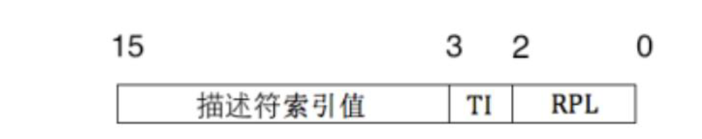
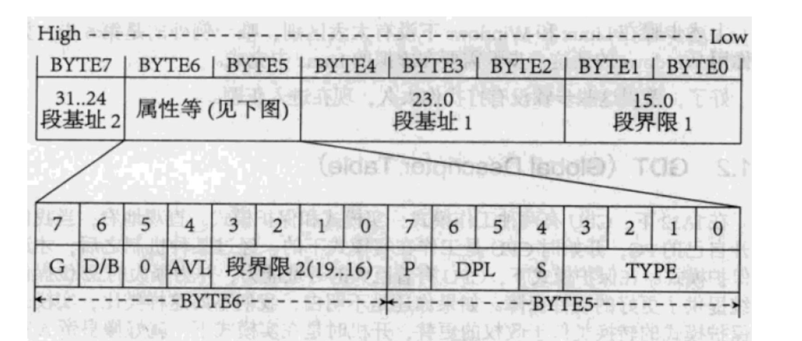

# Lab2: CheckList

## 什么是实模式? 什么是保护模式?

实模式就是基地址加偏移量就可以拿到物理地址的模式，非常不安全（获取物理地址的方式: 段基址 << 4 + 段内偏移）

保护模式就是不能直接拿到物理地址，需要进行地址转换才能得到物理地址的模式，从 80286 开始就是现代操作系统的主要模式。

## 什么是选择子?

共 16 位，放在段选择寄存器⾥，低 2 位表示请求特权级，第 3 位表示选择 GDT ⽅式还是 LDT ⽅式，⾼ 13 位表示在描述符表中的偏移。

## 什么是描述符?

组成描述符表的数据结构，共 64 位。

32 位段基址，规定线性地址空间中段的开始地址。

20 位段界限，规定段的大小。

12 位段属性位，规定段的主要属性，比如粒度位等。

## 什么是 GDT? 什么是 LDT?

GDT 是全局描述符表，是全局唯一的，存放一些公用的描述符，和包含各进程局部描述符表首地址的描述符。

LDT 是局部描述符表，每个进程都可以有一个，存放本进程内使用的描述符。

## 说明 GDTR 和 LDTR 的结构

GDTR: 48 位寄存器，高 32 位放 GDT 首地址，低 16 位放 GDT 限长，限长决定了可寻址的大小。

LDTR: 16 位寄存器，放一个特殊的选择子，用来查找当前进程的 LDT 首地址。

## 请说明 GDT 直接查找物理地址的具体步骤

1. 给出段选择子（段寄存器给出）+ 偏移量

2. 从 GDTR 中获得 GDT 首地址，用段选择子的 13 位作为偏移从 GDT 中取出段描述符

3. 如果合法且有权限，用描述符中的段基址 + 1 中的偏移量得到物理地址

## 请说明通过 LDT 查找物理地址的具体步骤

1. 给出段选择子（段寄存器给出）+偏移量

2. 从 GDTR 中获得 GDT 首地址，用 LDTR 中的偏移来作为偏移量，从 GDT 取出段描述符 1

3. 从描述符 1 中取出 LDT 的首地址，用段选择子的 13 位做偏移，从 LDT 中取出段描述符 2

4. 如果合法且有权限，用描述符 2 中的段首地址加上 1 中的偏移量找到物理地址。

## 根目录区的大小一定吗? 扇区号是多少? 为什么?

不一定，需要根据根目录项最大个数计算。

扇区号是 19，因为两个 FAT 表占 18 扇区，引导扇区占一个扇区。

## 数据区的第一个簇号是多少? 为什么?

FAT 表中 0 和 1 号的项内容是固定的，簇号 0 和 1 没有意义。

## FAT 表的作用

记录文件所在位置的表格，FAT 项的值代表文件的下一个簇号。

## 解释静态链接的过程

空间和地址分配，符号解析和重定位

## 解释动态链接的过程

动态链接器⾃举、装载共享对象、重定位和初始化、转交控制权

## 静态链接相关 ppt 中为什么使用 gcc 而不是 ld?

gcc 链接的时候会默认把库文件也加在后面

## linux 下可执行文件的虚拟地址空间默认从哪里开始分配?

0x8048000

## 如何进行 C 代码与汇编之间的参数传递和返回值传递

C 中的函数参数被压入栈中，汇编中通过 esp + 偏移来计算参数所在位置。

返回值被放在 eax 中

## 汇编代码中对 I/O 的处理方式，说明指定寄存器的值的含义

通过 esp + 偏移量计算传递的参数的位置，eax 存系统调用号，ebx 存文件描述符，ecx 存字符串地址，edx 存字符串长度