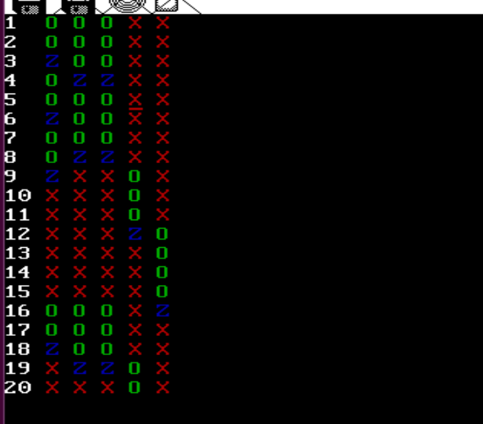
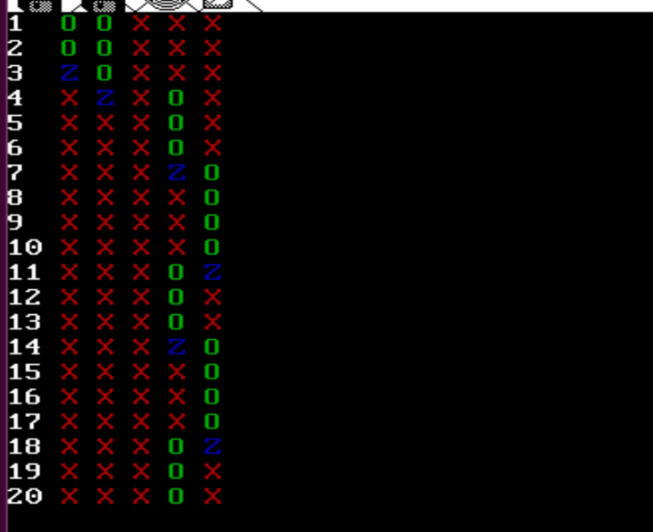

# Lab4 实验文档

## 读者写者问题

读者与写者问题(reader-writer problem) (Courtois,
1971)也是一个经典的并发程序设计问题。有两组并发进程：

读者和写者，共享一个文件F，要求：

(1)允许多个读者可同时对文件执行读操作

(2)只允许一个写者往文件中写信息

(3)任意写者在完成写操作之前不允许其他读者或写者工作

(4)写者执行写操作前，应让已有的写者和读者全部退出
使用PV操作求解该问题

## 实验要求

- 添加⼀个系统调用，其功能是接受⼀个 int 型参数 milli_seconds ，调⽤此系统调⽤的进程会在数milli_seconds 毫秒内不被分配时间片。

- 添加⼀个系统调用，其功能是接受⼀个 char * 型参数 str ，打印出 str 。

- 添加两个系统调⽤执⾏信号量PV操作，在此基础上模拟读者写者问题。**普通进程**A**每个时间⽚输出每个读者写者的状态**，格式为： [序号] [B] [C] [D] [E] [F] ，如 1 O O O X X ，每个状态用对应的

  符号加上对应的颜⾊表示。为了方便检查，只输出20次（序号从1～20）。

- 同时读的数量 𝑛 要求 𝑛 = 1, 2, 3均要实现，要求能够现场修改；读（写）完后休息的时间𝑡(𝑡 ≥ 0)可自定，每个进程休息时间可不同，要求能够现场修改。

- 请分别实现**读者优先**和**写者优先**策略，要求能够现场修改。

- 请想办法解决此问题中部分情况下的进程饿死问题（不能通过调整读写后的休息时⻓来解决，即即便

  $t=0$ 时也要想办法解决）。

## 实现

> 代码在第六章 r 节代码的基础上修改而来。

### 添加系统调用

```c
// 系统调用处理函数
void sys_sleep(int milli_seconds);
void sys_print(char* str);
void sys_P(void* semaphore);
void sys_V(void* semaphore);

// 封装的系统调用
void sleep(int milli_second);
void print(char* str);
void P(void* semaphore);
void V(void* semaphore);
```

#### 休眠系统调用处理函数的实现

```c
void sys_sleep(int milli_seconds) {
    // 需要先给 process 结构体添加一个 wake 属性
    p_proc_ready->wake = get_ticks() + (milli_seconds / (1000 / HZ));
	schedule();
}
```

#### 打印系统调用处理函数的实现

```c
void sys_print(char* str) {
    if (str[0] == 'X') {
        disp_c
    } else if (str[0] == 'O') {
        disp_color_str(str, BRIGHT | GREEN);
    } else if (str[0] == 'Z') {
        disp_color_str(str, BRIGHT | BLUE);
    } else {
        disp_str(str);
    }
}
```

#### 信号量 PV 操作系统调用处理函数的实现

```c
void sys_P(void* semaphore) {
	disable_irq(CLOCK_IRQ); // 关中断保证原语
	SEMAPHORE *s = (SEMAPHORE *)sem;
	s->value--;
	if (s->value < 0) {
		// 将进程加入等待队列尾
		p_proc_ready->status = 0;
		p_proc_ready->is_blocked = TRUE;
		s->queue[s->tail] = p_proc_ready;
		s->tail = (s->tail + 1) % NR_TASKS;
		schedule();
	}
	enable_irq(CLOCK_IRQ);
}

void sys_V(void* semaphore) {
	disable_irq(CLOCK_IRQ); // 关中断保证原语
	SEMAPHORE *s = (SEMAPHORE *)sem;
	s->value++;
	if (s->value <= 0) {
		// 释放等待队列头的进程
		PROCESS *proc = s->queue[s->head];
		proc->status = 0;
		proc->is_blocked = FALSE;
		s->head = (s->head + 1) % NR_TASKS;
	}
	enable_irq(CLOCK_IRQ);
}
```

### 读者优先策略实现

```c
void reader_rf(int work_time) {
	P(&m_reader_count);
	if (reader_count == 0)
		P(&writer_block); // 有读者，则禁止写
	reader_count++;
	V(&m_reader_count);

	P(&reader_limit);
	p_proc_ready->status = 1; // 状态设置为正在读, 0 表示等待, 2 表示休息
	milli_delay(work_time * TIME_SLICE);

	P(&m_reader_count);
	reader_count --;
	if (reader_count == 0)
		V(&writer_block); // 无读者，可写
	V(&m_reader_count);

	V(&reader_limit);
}
```

```c
void writer_rf(int work_time) {
	P(&writer_block);

	p_proc_ready->status = 1; // 状态设置为正在写
	milli_delay(work_time * TIME_SLICE);

	V(&writeBlock);
}
```

### 写者优先策略的实现

```c
void reader_wf(int work_time) {
	P(&reader_limit);

	P(&readr_block);

	P(&m_reader_count);
	if (reader_count == 0)
		P(&writer_block); // 有读者，则禁止写
	reader_count ++;
	V(&m_reader_count);

	V(&readr_block);

	// 进行读，对写操作加锁
	p_proc_ready->status = 1; // 1 表示正在读, 0 表示等待, 2 表示休息
	milli_delay(work_time * TIME_SLICE);

	// 完成读
	P(&m_reader_count);
	reader_count --;
	if (reader_count == 0)
		V(&writer_block); // 无读者，可写
	V(&m_reader_count);

	V(&reader_limit);
}
```

```c
void writer_wf(int work_time) {
	P(&m_writer_count);
	writer_count++;
	if (writer_count == 1)
		P(&reader_block); // 有写者，则禁止读
	V(&m_writer_count);

	// 开始写
	P(&writer_block);

	p_proc_ready->status = 1; // 1 表示正在写, 0 表示等待, 2 表示休息
	milli_delay(work_time * TIME_SLICE);

	// 完成写
	P(&m_writer_count);
	writer_count --;
	if (writer_count == 0)
		V(&reader_block); // 无写者，可读
	V(&m_writer_count);

	V(&write_block);
}
```

### 读写公平策略的实现

```c
void reader_fair(int work_time) {
	// 开始读
	P(&S);

	P(&reader_limit);
	P(&m_reader_count);
	if (reader_count == 0)
		P(&writer_block);
	V(&S);

	reader_count ++;
	V(&m_reader_count);

	// 进行读，对写操作加锁
	p_proc_ready->status = 1;
	milli_delay(work_time * TIME_SLICE);

	// 完成读
	P(&m_reader_count);
	reader_count --;
	if (reader_count == 0)
		V(&writer_block);
	V(&m_reader_count);

	V(&reader_limit);
}
```

```c
void writer_wf(int work_time) {
	P(&S);
	P(&writer_block);
	V(&S);

	// 开始写
	p_proc_ready->status = 1;
	milli_delay(work_time * TIME_SLICE);
	
	// 完成写
	V(&writer_block);
}
```

### 输出进程的实现

```c
void PrinterA() {
    int print_index = 1;
    while (TRUE) {
        if (print_index <= 20) {
            char * index_str;
            if (print_index < 10) {
                char tmp[2] = {'0' + print_index, '\0'};
                index_str = tmp;
            } else {
                char tmp[3] = {'0' + print_index / 10, '0' + print_index % 10, '\0'};
                index_str = tmp;
            }
            print(index_str);
            print(" ");
            
            for (int i = 1; i < NR_TASKS; i ++) {
                int status = proc_table[i].status;
                switch(status) {
                    case 0:
                        print("X ");
                        break;
                    case 1:
                        print("O ");
                        break;
                    case 2:
                        print("Z ");
                        break;
                    default:
                        break;
                }
            }
            
            print("\n");
            
            print_index ++;
        }
    }
}
```


## 结果分析

### 读者优先

#### 读并发量1


读并发量为1，因此总是会有读者在等待，在读者优先的情况下写者总是无法开始写，出现写者饿死的情况。

#### 读并发量2


并发量小于读者数量，因此同样总是会有读者进程在等待，也会出现写者进程饿死的现象。

#### 读并发量3



由于并发量 = 读者进程数量，因此不会存在总是有读者进程在等待的情况，不会出现写者进程饿死的情况。

### 写者优先



写者优先，读并发量为 2 的情况，只要一直有写者在等待，就会饿死读者进程，这是因为写者进程数量大于写并发量1.

### 读写公平


读写公平的情况下，尽管读并发量为2，也没有产生读者或者写者进程饿死的情况。